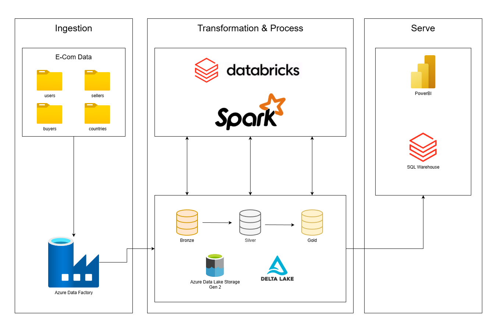

# E-Commerce Data Platform

An end-to-end data engineering project built on **Azure Databricks** implementing a Medallion Architecture (Bronze → Silver → Gold) for an e-commerce marketplace dataset. The pipeline ingests raw user, buyer, seller, and country data from Azure Data Lake Storage Gen2, applies progressive transformations, and surfaces insights through an interactive Lakeview dashboard.

## Table of Contents

- [Architecture](#architecture)
- [Project Structure](#project-structure)
- [Tech Stack](#tech-stack)
- [Data Sources](#data-sources)
- [Pipeline Layers](#pipeline-layers)
  - [Bronze Layer](#bronze-layer--raw-ingestion)
  - [Silver Layer](#silver-layer--cleansed--enriched)
  - [Gold Layer](#gold-layer--business-ready)
- [Gold Table Schema](#gold-table-schema)
- [Data Quality & Bug Fixes](#data-quality--bug-fixes)
- [Dashboard](#dashboard)
- [Key Business Insights](#key-business-insights)
- [Setup & Configuration](#setup--configuration)

---

## Architecture



High-level flow from ingestion to serving:

- **Ingestion (Azure Data Factory → ADLS Gen2)**: Raw e-commerce data (`users`, `buyers`, `sellers`, `countries`) lands in the data lake.
- **Transformation & Processing (Databricks / Spark with Delta Lake)**: Data is incrementally refined through Bronze, Silver, and Gold Delta tables following the Medallion pattern.
- **Serve (SQL Warehouse / Power BI)**: The Gold table is exposed via Unity Catalog and queried by a SQL Warehouse powering dashboards and analytics.

```
┌─────────────────┐     ┌─────────────┐     ┌──────────────┐     ┌─────────────┐
│  Landing Zone   │────▶│   Bronze    │────▶│    Silver    │────▶│    Gold     │
│  (ADLS Gen2)    │     │  (Raw Delta)│     │  (Cleansed)  │     │  (Joined)   │
│                 │     │             │     │              │     │             │
│ • users.parquet │     │ • users     │     │ • users      │     │ ecom_one_   │
│ • buyers.parquet│     │ • buyers    │     │ • buyers     │     │ big_table   │
│ • sellers.pqt   │     │ • sellers   │     │ • sellers    │     │             │
│ • countries.pqt │     │ • countries │     │ • countries   │     │ (98,913 rows│
│                 │     │             │     │              │     │  21 columns) │
└─────────────────┘     └─────────────┘     └──────────────┘     └──────┬──────┘
                                                                       │
                                                              ┌────────▼────────┐
                                                              │  Unity Catalog  │
                                                              │  Managed Table  │
                                                              │                 │
                                                              │ ecom_db_kyle.   │
                                                              │ default.        │
                                                              │ gold_ecom_users │
                                                              └────────┬────────┘
                                                                       │
                                                              ┌────────▼────────┐
                                                              │    Lakeview     │
                                                              │   Dashboard     │
                                                              │                 │
                                                              │ 3 pages, 20+    │
                                                              │ visualizations  │
                                                              └─────────────────┘
```

## Project Structure

```
├── notebooks/
│   ├── Bronze Layer.ipynb              # Raw ingestion (Landing Zone → Bronze Delta)
│   ├── Silver Layer.ipynb              # Data cleaning & enrichment (Bronze → Silver)
│   └── Gold Layer.ipynb                # Join, validate & register (Silver → Gold)
├── dashboards/
│   └── sql ddl/                        # Lakeview dashboard SQL sources
│       ├── business_kpis.sql
│       ├── market_efficiency.sql
│       ├── social_influ_vs_sales.sql
│       ├── app_adoption_by_market.sql
│       ├── users_engagement_segment.sql
│       ├── wish_to_sale_by_country.sql
│       ├── sellers_gender_long.sql
│       ├── buyers_vs_sellers_long.sql
│       ├── country_market_data.sql
│       └── users_by_country.sql
├── architectures/
│   └── Azure Ecom Data Architecture.drawio   # Source for architecture diagram
├── data/
│   ├── chunk-user-data/                      # Sampled user data chunks
│   ├── 6M-0K-99K.users.dataset.public.csv
│   ├── users.6M0xxK.2024.public.csv
│   ├── Countries-with-Top-Sellers-(Fashion-C2C).csv
│   ├── Buyers-repartition-by-country.csv
│   └── Comparison-of-Sellers-by-Gender-and-Country.csv
└── README.md
```

## Tech Stack

| Component | Technology |
| --- | --- |
| Cloud Platform | Microsoft Azure |
| Compute | Azure Databricks (Photon Runtime 17.3, Scala 2.13) |
| Storage | Azure Data Lake Storage Gen2 (ADLS) |
| Data Format | Delta Lake |
| Processing | Apache Spark (PySpark) |
| Catalog | Unity Catalog |
| Dashboard | Databricks Lakeview (SQL Warehouse) |
| Authentication | Azure AD Service Principal (OAuth 2.0) |
| Languages | Python, SQL |

## Data Sources

The dataset represents a global e-commerce marketplace with four entity types:

| Dataset | Description | Raw Rows |
| --- | --- | --- |
| **Users** | Individual user profiles with app usage, social metrics, and product activity | 98,913 |
| **Buyers** | Country-level buyer aggregates (total, top, gender breakdowns) | 201 |
| **Sellers** | Country-level seller stats with gender splits (male/female rows per country) | 70 |
| **Countries** | Country-level marketplace metrics (seller ratios, product stats) | 218 |

### Storage Paths (ADLS Gen2)

```
abfss://landing-zone-2@ecomadlskyle.dfs.core.windows.net/   # Raw parquet files
abfss://bronze@ecomadlskyle.dfs.core.windows.net/           # Bronze Delta tables
abfss://silver@ecomadlskyle.dfs.core.windows.net/           # Silver Delta tables
abfss://gold@ecomadlskyle.dfs.core.windows.net/             # Gold Delta table
```

---

## Pipeline Layers

### Bronze Layer — Raw Ingestion

**Notebook:** `Bronze Layer.ipynb`

Minimal transformation layer that reads raw Parquet files from the landing zone and persists them as Delta tables. Acts as an immutable audit log.

**Operations:**
1. Configure Azure ADLS OAuth authentication
2. Read each Parquet dataset from the landing zone
3. Write to Bronze container as Delta format (`mode=overwrite`)

**Tables produced:** `bronze/users`, `bronze/buyers`, `bronze/sellers`, `bronze/countries`

---

### Silver Layer — Cleansed & Enriched

**Notebook:** `Silver Layer.ipynb` (31 cells)

The heavy-lifting layer — applies data cleaning, type casting, standardization, and feature engineering.

#### Users (17 transformations)
- Normalize country codes to uppercase
- Map language codes to full names (`EN` → `English`, `FR` → `French`, `DE` → `German`, else `Other`) with case-insensitive matching
- Standardize gender values (`M`/`F`/`Unknown`)
- Clean civility titles (`Mme`/`Mrs` → `Ms`)
- Calculate `years_since_last_login` from days
- Categorize `account_age_group` (`New` / `Intermediate` / `Experienced`)
- Create composite `user_descriptor` (gender + country + title + language)
- Cast boolean columns (`hasanyapp`, `hasandroidapp`, `hasiosapp`, `hasprofilepicture`)
- Cast `dayssincelastlogin` to Integer (null → 0)
- Deduplicate by `identifierHash`

#### Buyers (6 transformations)
- Cast 9 columns to Integer, 19 columns to Decimal(10,2)
- Normalize country names with `initcap()`
- Fill null integers with 0
- Calculate `female_to_male_ratio` and `wishlist_to_purchase_ratio`
- Flag `high_engagement` countries (bought/wishlist ratio > 0.5)
- Flag `growing_female_market` where female ratio exceeds top female ratio

#### Sellers (5 transformations)
- Cast 17 columns to appropriate numeric types
- Normalize country names; uppercase sex column
- Filter out literal `'None'` country values
- Categorize `seller_size_category` (Small / Medium / Large)
- Flag `high_seller_pass_rate` markets; impute null pass rates with column average

#### Countries (5 transformations)
- Cast 25 columns to Integer or Decimal types
- Normalize country names with `initcap()`
- Calculate `top_seller_ratio` with division-by-zero guard
- Flag `high_female_seller_ratio` countries (>50%)
- Categorize `activity_level` by mean offline days

**Tables produced:** `silver/users`, `silver/buyers`, `silver/sellers`, `silver/countries`

---

### Gold Layer — Business-Ready

**Notebook:** `Gold Layer.ipynb` (11 cells)

Produces a single denormalized table joining all four Silver tables on `country`, optimized for analytics.

**Key design decisions:**
1. **Pre-aggregate sellers** by country before joining — sellers have male/female rows per country; without aggregation, each user row would be duplicated
2. **LEFT joins** from users to all reference tables (users is the primary grain)
3. **Column aliasing** with clear prefixes (`Users_`, `Countries_`, `Buyers_`, `Sellers_`)

**Additional steps:**
- Write Gold Delta table to ADLS
- Register as Unity Catalog managed table (`ecom_db_kyle.default.gold_ecom_users`) for SQL warehouse access
- Archive processed source files from landing zone
- Run data quality report (null rates, duplicate checks)
- End-to-end pipeline validation (Bronze → Silver → Gold row count reconciliation)

**Table produced:** `gold/ecom_one_big_table` → registered as `ecom_db_kyle.default.gold_ecom_users`

---

## Gold Table Schema

**98,913 rows × 21 columns** — one row per user, enriched with country-level market data.

| Column | Type | Description |
| --- | --- | --- |
| `IdentifierHash` | string | Unique user identifier (hashed for privacy) |
| `Country` | string | User's country (join key) |
| `Users_productsSold` | string | Products sold by user |
| `Users_productsWished` | string | Products wishlisted by user |
| `Users_hasanyapp` | boolean | Whether user has any app installed |
| `Users_socialnbfollowers` | integer | User's social follower count |
| `Countries_Sellers` | integer | Total sellers in user's country |
| `Countries_TopSellers` | integer | Top-performing sellers in country |
| `Countries_FemaleSellers` | integer | Female sellers in country |
| `Countries_MaleSellers` | integer | Male sellers in country |
| `Countries_TopFemaleSellers` | integer | Top female sellers in country |
| `Countries_TopMaleSellers` | integer | Top male sellers in country |
| `Buyers_Total` | integer | Total buyers in country |
| `Buyers_Top` | integer | Top buyers in country |
| `Buyers_Female` | integer | Female buyers in country |
| `Buyers_Male` | integer | Male buyers in country |
| `Buyers_TopFemale` | integer | Top female buyers in country |
| `Buyers_TopMale` | integer | Top male buyers in country |
| `Sellers_Total` | long | Aggregated seller count for country |
| `Sellers_MeanProductsSold` | decimal(10,2) | Average products sold per seller |
| `Sellers_MeanProductsListed` | decimal(10,2) | Average products listed per seller |

---

## Data Quality & Bug Fixes

During development, 8 data quality bugs were identified and resolved:

### Silver Layer Fixes

| # | Bug | Root Cause | Fix |
| --- | --- | --- | --- |
| 1 | **Users 6× duplication** (593K → 98,913) | `.mode("append")` on re-runs accumulated duplicates | Changed to `.mode("overwrite")` |
| 2 | **Language mapping failure** (all mapped to "Other") | Case-sensitive comparison (`'en'` ≠ `'EN'`) | Added `upper(language)` for case-insensitive matching |
| 3 | **Variable typo** | `usesrDF` instead of `usersDF` | Fixed typo |
| 4 | **Sellers 'None' values** (73 → 70 rows) | Literal string `"None"` in country column | Added filter: `~col("country").isin("None", "none", "NONE")` |
| 5 | **Division by zero** | `topsellers / sellers` when `sellers = 0` | Added `when(col("sellers") > 0, ...)` guard |
| 6 | **Empty DataFrame crash** | `.collect()[0]` on potentially empty result | Added empty-check before accessing row |

### Gold Layer Fixes

| # | Bug | Root Cause | Fix |
| --- | --- | --- | --- |
| 7 | **Join explosion** (936,282 → 98,913 rows) | Sellers table has male/female rows per country; direct join multiplied user rows | Pre-aggregate sellers by country before join; changed outer → left joins |
| 8 | **Data quality check errors** | `isnan()` applied to non-numeric columns; `round()` shadowing built-in | Conditionally apply `isnan()` to numeric types only; use f-string formatting |

---

## Dashboard

**E-Commerce Platform Analytics** — Built with Databricks Lakeview, powered by a SQL Warehouse querying the Unity Catalog Gold table.

### Page 1: Overview

High-level platform metrics and geographic distribution.

| Widget | Type | Metric |
| --- | --- | --- |
| Total Users | Counter | 98,913 |
| Countries | Counter | 200 |
| App Adoption Rate | Counter | 26.5% |
| Top Countries by Users | Bar Chart | Top 15 countries |
| App Adoption | Pie Chart | Has App (26,174) vs No App (72,739) |
| Buyers vs Sellers | Bar Chart | Side-by-side comparison by country |
| Top Countries by Sellers | Bar Chart | Seller volume distribution |
| Buyers vs Sellers Correlation | Scatter Plot | Country-level relationship |
| Gender Split (Sellers) | Bar Chart | Female vs Male sellers by country |

### Page 2: Business Intelligence

Deep-dive into engagement, conversion, and market efficiency.

| Widget | Type | Metric |
| --- | --- | --- |
| Active Seller Rate | Counter | 2.1% (97.9% inactive) |
| Avg Products Wished | Counter | 1.56 per user |
| Avg Products Sold | Counter | 0.12 per user |
| Wish-to-Sale Conversion | Counter | 7.8% |
| Engagement Funnel | Bar Chart | Inactive (96,877) → Light (1,578) → Moderate (339) → Power (119) |
| Social Influence vs Sales | Bar Chart | Follower tiers vs avg products sold |
| App Adoption by Market | Bar Chart | Netherlands 56.5% vs US 12.1% |
| Wish→Sale by Country | Bar Chart | Taiwan 52.3%, Italy 16.3%, France 13.8% |
| Market Scatter | Scatter | Buyers vs Sellers with user count |

### Page 3: Global Filters

Cross-page multi-select country filter applied to all datasets.

---

## Key Business Insights

**Printed dashboards:** [E-Commerce Platform Analytics (PDF 1)](@dashboards/E-Commerce Platform Analytics 2026-03-16 05_23.pdf) and [E-Commerce Platform Analytics (PDF 2)](@dashboards/E-Commerce Platform Analytics 2.pdf).

1. **Massive seller activation opportunity** — 97.9% of users have never sold anything. Only 119 users qualify as "Power Sellers" (5+ products sold).

2. **Wishlist-to-sale gap** — Users wishlist 13× more products than they purchase (1.56 wished vs 0.12 sold per user), indicating high browse intent but conversion friction.

3. **Social followers predict sales** — Users with 100+ followers sell an average of 92 products vs 1.3 for those with 0–10 followers (a 70× multiplier).

4. **App adoption is highly regional** — Ranges from 56.5% (Netherlands) to 12.1% (US), suggesting localized growth strategies would be effective.

5. **Supply-demand imbalance** — Germany has a 5.5× buyer-to-seller ratio, representing a high-demand, low-supply market.

6. **Taiwan leads in conversion efficiency** — 52.3% wish-to-sale conversion rate, far exceeding the platform average of 7.8%.

---

## Setup & Configuration

### Prerequisites

- Azure Databricks workspace
- Azure Data Lake Storage Gen2 account
- Azure AD Service Principal with Storage Blob Data Contributor role
- Databricks cluster with Photon Runtime 17.3+ (or compatible)
- Unity Catalog enabled workspace (for Gold table registration)

### Configuration

Each notebook configures ADLS access via OAuth 2.0 Service Principal credentials. Update the following values in Cell 1 of each notebook:

```python
storage_account_name = "<STORAGE_ACCOUNT_NAME>"
client_id = "<CLIENT_ID>"
tenant_id = "<TENANT_ID>"
client_secret = "<CLIENT_SECRET>"
```

> **Security Note:** For production use, store credentials in Azure Key Vault and reference them via Databricks secret scopes instead of hardcoding.

### Execution Order

Run the notebooks sequentially:

```
1. Bronze Layer.ipynb   → Ingests raw Parquet → Delta
2. Silver Layer.ipynb   → Cleans, casts, enriches
3. Gold Layer.ipynb     → Joins, validates, registers to Unity Catalog
```

### Unity Catalog Registration

The Gold table is registered as a managed UC table so the SQL Warehouse (which cannot access ADLS OAuth credentials from the notebook Spark session) can query it for the dashboard:

```sql
CREATE TABLE IF NOT EXISTS ecom_db_kyle.default.gold_ecom_users
AS SELECT * FROM delta.`abfss://gold@ecomadlskyle.dfs.core.windows.net/ecom_one_big_table`;
```

---

## License

This project was built as a personal data engineering portfolio project.
